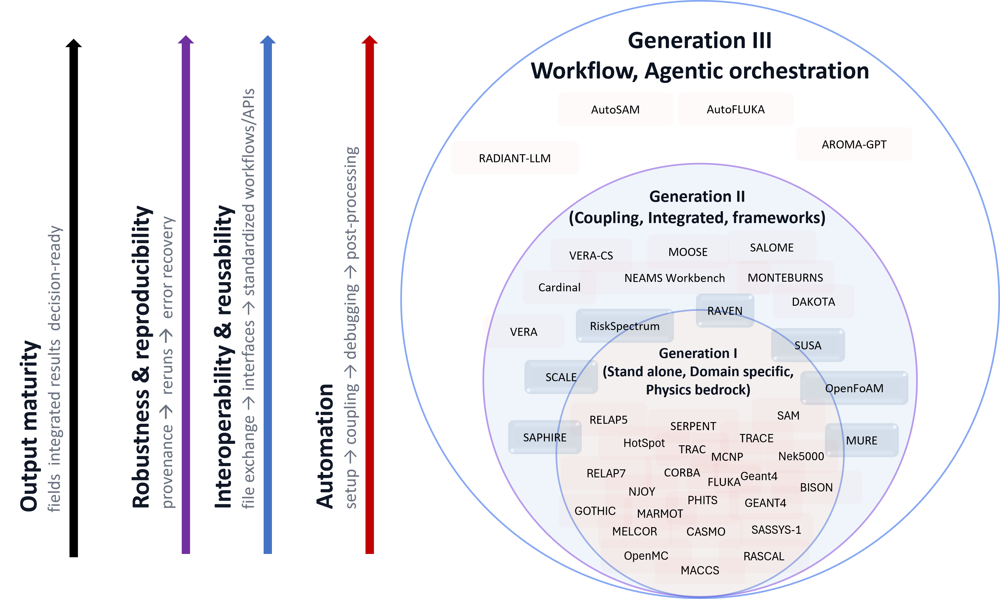

# GenAI-powered-nuclear-ms

A novel GenAI-driven paradigm for nuclear M&S: an intelligent orchestration layer that coordinates tool-using agents + multimodal knowledge retrieval for automated workflows and traceable decision support for engineers (human-in-the-loop, 3S-aligned).

---

## What this repository contains

This repository serves as the **public companion hub** for the GenAI-powered nuclear modeling & simulation methodology developed in my PhD thesis work. It hosts **high-resolution figures**, **interactive HTML visualizations**, **public-facing documentation**, and other thesis materials suitable for public dissemination.

> **Note:** Source code is intentionally kept out of this repository and maintained in specialized repositories (linked below).

---

## Interactive figures

### Nuclear M&S software taxonomy (interactive HTML)

**Open in browser (GitHub Pages):**  
https://smartlabnuclear.github.io/GenAI-powered-nuclear-ms/figures/interactive/nuclear-ms-taxonomy/nuclear_ms_tree.html

**Offline use:**  
Download and open locally:
`figures/interactive/nuclear-ms-taxonomy/nuclear_ms_tree.html`

**How to use:** zoom/pan, expand/collapse nodes, and click software nodes to view additional details (links, descriptions, classification tags).

---
### Nuclear M&S “Generations” paradigm (draft)
A first-draft visualization proposing a **GenAI-driven Generation III** layer on top of Generation I (standalone codes) and Generation II (integrated multi-physics frameworks). We posit that the field is entering a transition in which GenAI-enabled, tool-using agents and multimodal knowledge retrieval may act as an ``orchestration layer'' above existing simulation codes and integrated frameworks. In this view, Generation III does not replace Generation I/II physics solvers; rather, it augments them by reducing workflow friction (setup, coupling, debugging, post-processing), improving traceability and reproducibility, and enabling human-in-the-loop decision support. As these orchestration capabilities mature, the integrated workflows may expand rapidly, filling gaps that have historically been limited by integration overhead and operational complexity.

<!-  -->
  

---

## Repository structure (high-level)

*(Folders may be added/expanded as the public thesis companion materials grow.)*

---

## Related systems (specialized repositories)

These systems are core artifacts of the GenAI-powered nuclear M&S paradigm and are maintained in dedicated repositories:

- **AutoFLUKA** — GenAI-assisted Monte Carlo workflow orchestration *(link to be added)*
- **AutoSAM** — autonomous system TH workflow + error detection/resolution *(link to be added)*
- **RADIANT-LLM** — multimodal nuclear knowledge base + evaluation *(link to be added)*
- **AROMA-GPT** — digital-twin supervisory assistant (human-in-the-loop) *(link to be added)*

> If you share the repo URLs, you can replace “(link to be added)” with the direct links.

---

## Citation / thesis linkage

If you reference figures from this repository (e.g., in the dissertation), cite the interactive version using the GitHub Pages link above.  
A recommended sentence to place near the figure caption:

> “An interactive version of this figure is available at the project repository GitHub Pages site.”

---

## License

To be added (once the public release scope is finalized).
